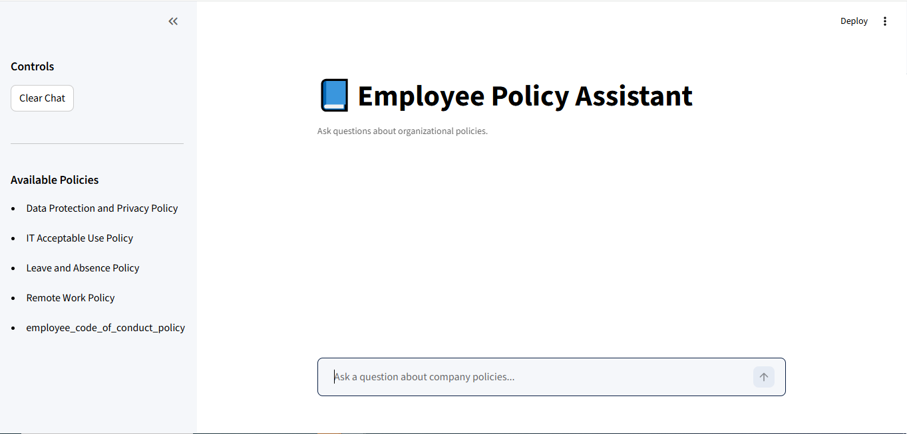
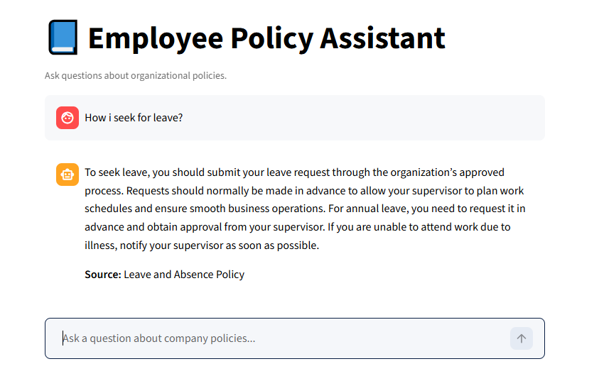

# AI-Powered Policy Assistant (RAG Chatbot)

## Overview
This project is an AI-powered conversational agent designed to improve employee access to organisational policy documents through natural language interaction.

## Use Case
This system can be used within organisations to provide employees with quick and accurate access to internal policies without manually searching through documents.

The system uses a Retrieval-Augmented Generation (RAG) approach to retrieve relevant policy content and generate accurate, context-aware responses. It enables users to ask questions in plain English and receive grounded answers directly from internal policy documents.

## Screenshots



## Features
- Natural language querying of policy documents
- Semantic search using vector embeddings
- Source-based responses grounded in policy content
- Session-based conversational memory
- Interactive web interface using Streamlit

## Tech Stack
- Python
- LangChain
- ChromaDB (Vector Database)
- OpenAI API (GPT-4.1-mini)
- Streamlit

## How the System Works
1. Policy documents are loaded from the `Data/` directory  
2. Documents are split into structured text chunks  
3. Each chunk is converted into a vector embedding  
4. Embeddings are stored in a persistent Chroma vector database  
5. User queries are embedded and matched using semantic similarity search (MMR)  
6. Relevant policy content is inserted into a prompt  
7. GPT-4.1-mini generates a grounded response  
8. The response is displayed via the Streamlit interface  

---

## Installation

### 1. Install Dependencies
```bash
pip install -r requirements.txt
```

### 2. Configure Environment Variables
Create a `.env` file in the root directory and add:

```bash
OPENAI_API_KEY=your_openai_api_key_here
```

> ⚠️ The `.env` file is not included for security reasons.

---

### 3. Build the Vector Database

The application automatically builds the vector database on first run if it does not already exist.

Ensure that PDF policy documents are placed in the `Data/` folder before running the application. The system will process and index these documents for semantic search.  

---

### 4. Run the Application
```bash
streamlit run app.py
```

---

## Project Structure
```bash
/app.py                 # Streamlit application
/build_vector_db.py     # Builds vector database
/requirements.txt       # Dependencies
/Data/                  # Policy documents (not included)
/chroma_db/             # Generated vector database
```

---

## Security Considerations
- API keys are stored securely using environment variables  
- No credentials are hardcoded  
- Only relevant query context is sent to the OpenAI API  
- Vector database is stored locally  

---

## Evaluation
The `evaluation/` folder contains:
- User testing questionnaire  
- Anonymised responses  

These support the evaluation conducted during the project.

---

## Notes
- The vector database is built automatically on first run   
- Rebuild the database if policy documents are updated   

---

## Author
**Ademilola Shonibare**  
MSc Computing & Information Systems  
University of South Wales
